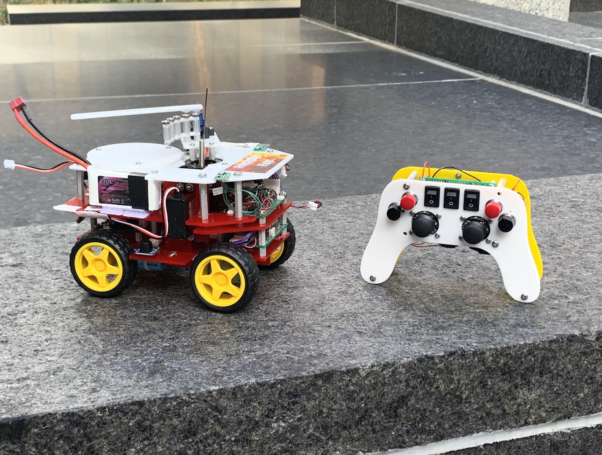
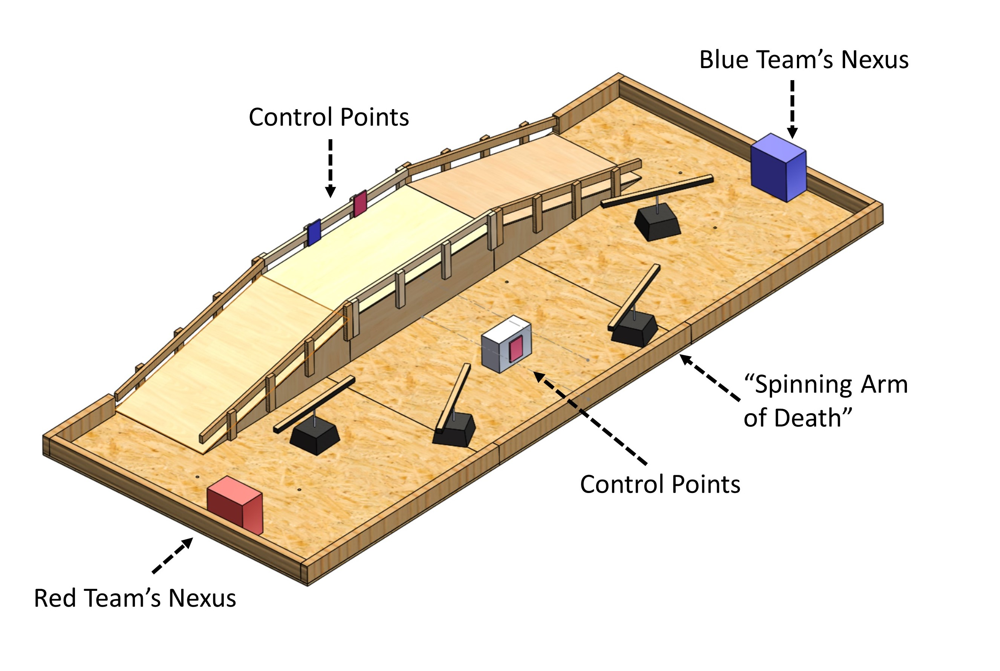
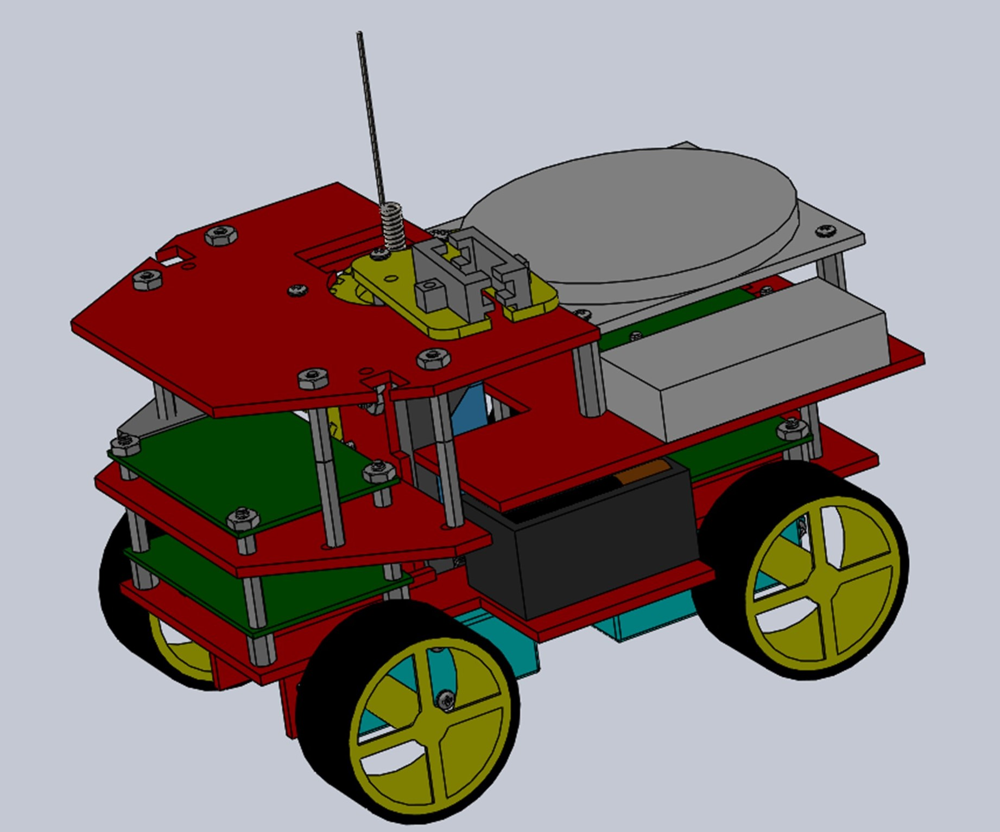
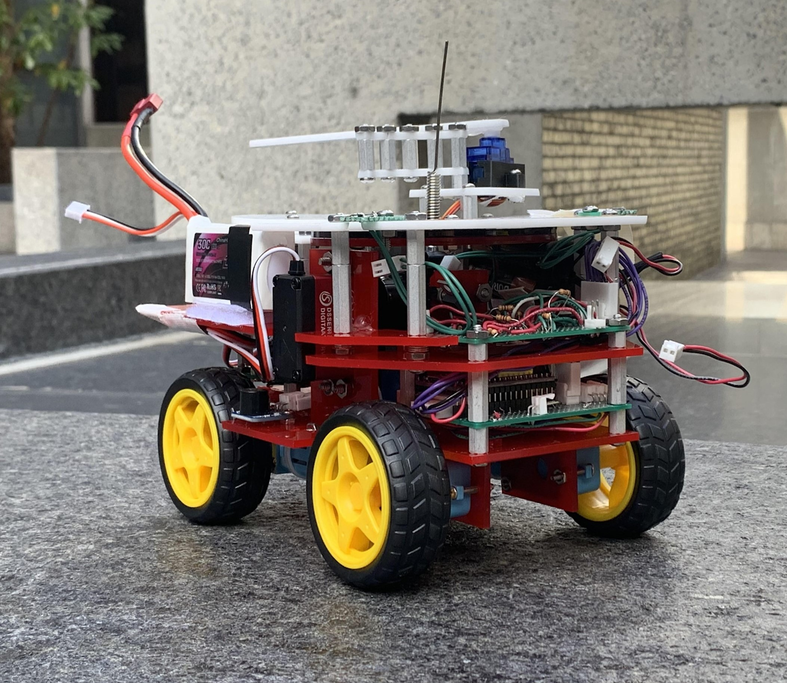
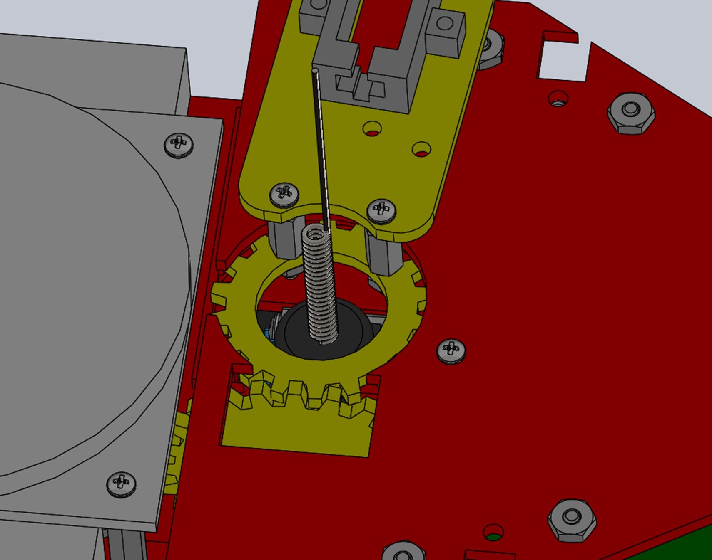
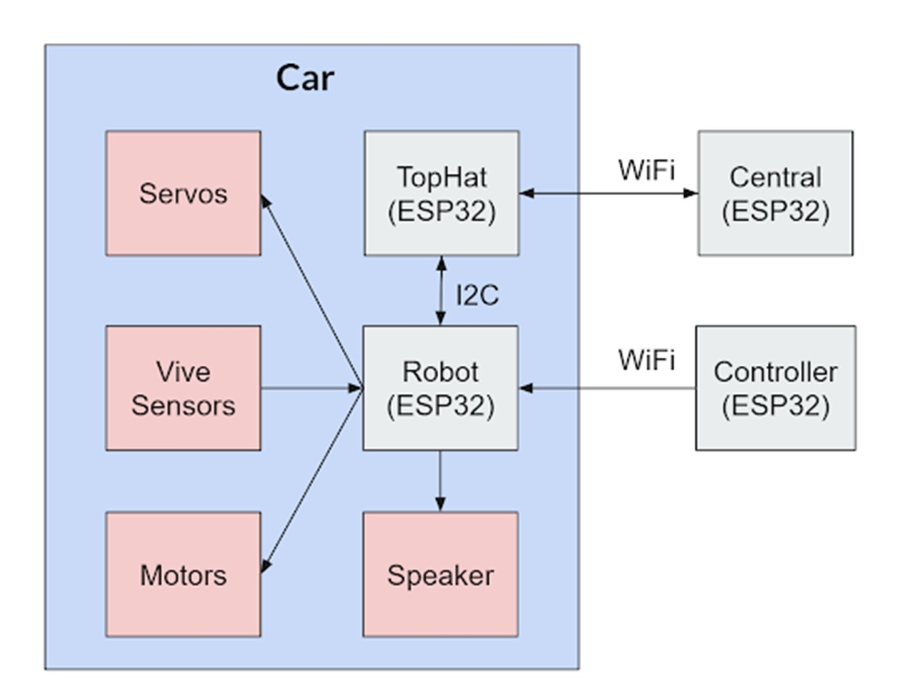

# Battle Bot Competition
October 2019 - December 2019

As the final project for a graduate mechatronics class, three teammates and I developed a "battle bot" within the competitions constraints and a $100 budget. Each bot was a member of a four bot meta-team in which teams could strategically choose complimentary attributes. In our meta-team, our bot had a heavy-weight / brawler style with the goals of durability and pushing enemy bots by controlling positioning through weight, drivetrain power, and traction.

## Map

Our vehicle operated autonomously using existing knowledge of its environment as well as determining its position and orientation through two IR photodiodes. These sensors detect waves of IR pulses emitted from a "lighthouse" used with the HTC Vive Virtual Reality Headset. 

Vehicles in the game can do virtual damage to each other by hitting the whisker switch rising from the center of our vehicle. 

[YouTube link to an excellent (third-party) visualiztion of how the VR localization works](https://www.youtube.com/watch?v=J54dotTt7k0)

   
   

  

## Hardware

Our choice to develop a heavier and more capable bot impacted the design to accomodate the volume and weight associated with the 20 Kg servo motor (used in for rotating the shield / weapon assembly) and four DC motors in the drivetrain (when two was more common among our competitors).

  
   

The articulated defensive shield was the most unique component of the bot and the result of a gameplay constraint specifying that no more than 90° of the whisker switch could be blocked at a given time. The perpendicular gearing enabled circumferential movement around the central whisker to quickly block attacks without moving the bulky and slow wheelbase of the bot. 

Vehicles in the game can do virtual damage to each other by hitting the whisker switch rising from the center of our vehicle. We designed a shield to orbit around the whisker to block incoming attacks in addition to our own weapon.

   

  

## Software

Our bot's life points and team color were indicated with this LED ring. 

   

  

HTC Vive Photo-Diode Localization: Reverse engineered the circuit surrounding the photodiode and developed the software to utilize the HTC Vive "Lighthouse" as a position and orientation localizer. A link to an animation of the "Lighthouse" can be found in the map description for this project.

   

  

## System Architecture

The "TopHat" monitored the whisker switch (antenna-like wire rising from the car's center) and communicated with the LED display. Information regarding damage sustained by the car was relayed to "Central", a global monitoring system in communication with all team's cars.

   

  

## Electrical

Vive:

   

Controller:

   

  

Motor:

   

Tophat:

   

  
