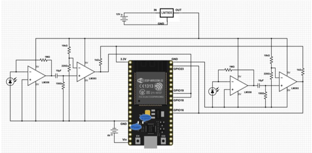

# Battle_Bot

Aug 2019 - Dec 2019

## Overview
As the final project for the graduate mechatronics class, teams of four students worked to develop a unique vehicle within the constraints of the gameplay rules and a $100 budget. Our vehicle operated autonomously using existing knowledge of its environment as well as determining its position and orientation through two IR photodiodes. These sensors detect waves of IR pulses emitted from a "lighthouse" used with the HTC Vive Virtual Reality Headset. Vehicles in the game can do virtual damage to each other by hitting the whisker switch rising from the center of our vehicle. We designed a shield to orbit around the whisker to block incoming attacks in addition to our own weapon.Click [HERE](https://www.youtube.com/watch?v=J54dotTt7k0) for a YouTube link to an excellent (third-party) visualization of how the VR localization works.

System Architecture: The "TopHat" monitored the whisker switch (antenna-like wire rising from the car's center) and communicated with the LED display. Information regarding damage sustained by the car was relayed to "Central", a global monitoring system in communication with all team's cars.

   

  

   

  

## Hardware

Defensive Shield Design: The gearing enabled circumferential movement around the central whisker. This decision greatly impacted our available space within the vehicle but was a major advantage over other vehicle which could not defend against all angles.

## Software

HTC Vive Photo-Diode Localization: Reverse engineered the circuit surrounding the photodiode and developed the software to utilize the HTC Vive "Lighthouse" as a position and orientation localizer. A link to an animation of the "Lighthouse" can be found in the general description for this project.

## Electrical

